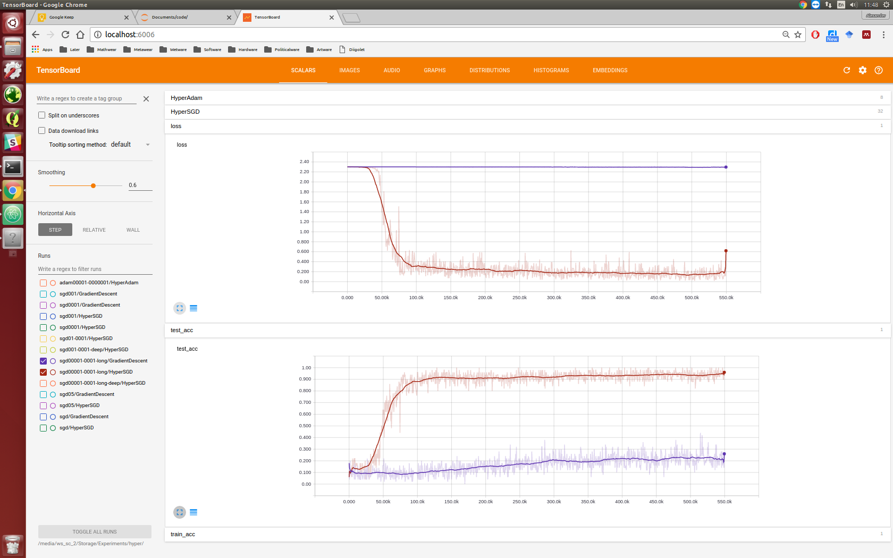

Testing hyper optimisation as proposed in [Baydin et al. 2017](https://arxiv.org/abs/1703.04782)).

### Experiment.

Compare traditional and hyper optimisation.
Doing gradient desent on the learning rate.
Test with gradient clipping

### Results.

should just add the summaries?

problem. we have sacrificed some stability?!

### Conclusion.

Saves some time doing a hyper parameter search for the lr.
If the lr was correctly chosen initially, hyperopt doesnt really help.
Can we also use this for other hyper parameters?
