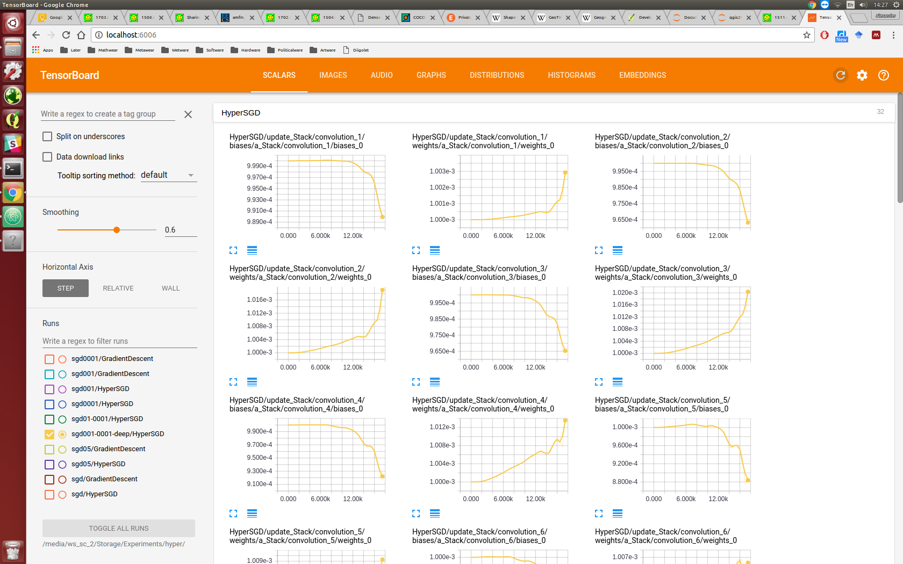

### Experiment.

Compare traditional and hyper optimisation.
Doing gradient desent on the learning rate.

### Results.

should just add the summaries?

### Conclusion.

Saves some time doing a hyper parameter search for the lr.
If the lr was correctly chosen initially, hyperopt doesnt really help.
Can we also use this for other hyper parameters?
