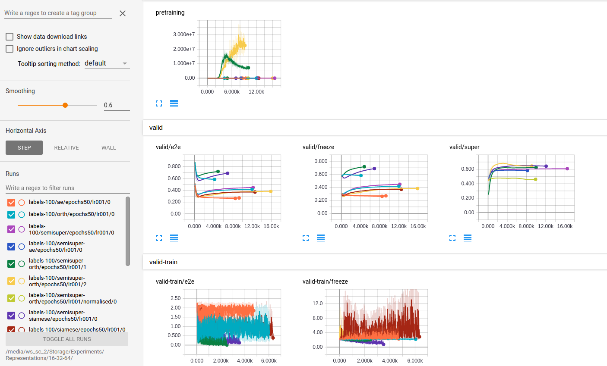

* Would have expected end-to-end training to do better than 45-46%. (I really need validation accuracy on the validation-training.)
* Also. It seems interesting that there was any difference at all, consider I was training end-to-end, this means the only difference is the init! However, they do end up being pretty close (within a couple of percent).
***

* Orthogonal does best in e2e, freeze and semi-super. (with siamese close behind). However orthogonal seems to explode as well?! Why?
* Semi-super gets the best performance.
* Why does the validation accuracy go down in e2e? Does this mean that the orthogonal init was better than whatever was learnt?
* Suprising that e2e and freeze are almost exactally the same value after more interations of training. Would have expected that e2e would do better.

***

* just semisupervised runs. 200 labels (73%) < 200 labels + orth (82%).
* expected to see more overfitting?! especially on 100-200 labels?!
***
