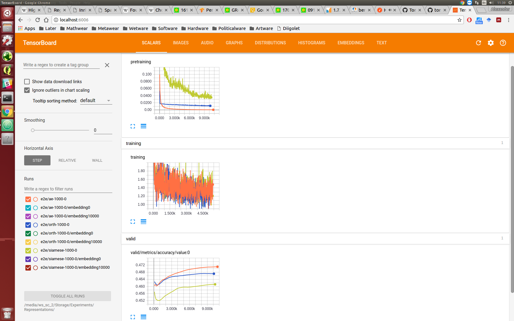

* Would have expected end-to-end training to do better than 45-46%. (I really need validation accuracy on the validation-training.)
* Also. It seems interesting that there was any difference at all, consider I was training end-to-end, this means the only difference is the init! However, they do end up being pretty close (within a couple of percent).

